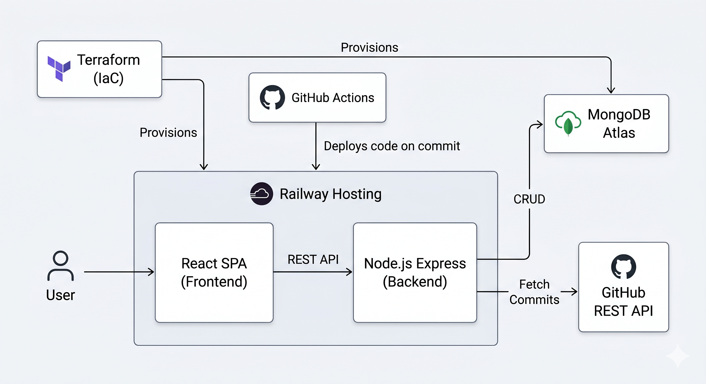

# ReleaseForge 🛠️
**URL**
https://projectsummer.click


**Automated Changelog Builder**



## 📢 Week 8 Update: Project Status (Proof of Concept)

**✅ Work Completed (Project Setup & Framework):**
* **Express Server & Middleware:** Fully functional Express server running, configured with CORS, JSON parsing, and secure proxy trust for deployment.
* **Database Connection:** Successful integration with **MongoDB Atlas** using Mongoose.
* **Authentication Framework:** Implemented a robust OAuth workflow using `passport-github2`. Users can successfully log in via GitHub, and their profiles (along with the necessary `accessToken` for future API calls) are saved directly into the MongoDB database.
* **Session Management:** Configured secure, HTTP-only cookies and integrated `connect-mongo` to store active user sessions persistently in the database.
* **Frontend Scaffolding:** React SPA initialized with React Router. Built a landing/login page and a protected Dashboard component that successfully verifies user sessions with the backend.
* **API Routing Framework:** Modularized routing structure is in place (e.g., `/api/auth`, `/api/commits`), ready for expansion.

**🚧 Work Still Needs to be Done:**
* Complete the remaining Mongoose schemas (`Project`, `Release`, `ChangelogItem`).
* Finish the CRUD API routes for managing projects and generated changelogs.
* Connect the frontend Dashboard to the `/api/commits` route to fetch and display the user's real GitHub commit history.
* Build the interactive UI for parsing and categorizing commits into "Features", "Fixes", etc.
* Final UI styling (using vanilla CSS) and production deployment tweaks on AWS.

---

ReleaseForge is a productivity tool tailored for software development teams, independent developers, and product managers. It focuses on the product release lifecycle by streamlining the creation of clean, professional release notes and changelogs.

---

## 🛑 Problem Statement

Writing release notes is a tedious task that developers often neglect. Raw Git commit messages are usually too technical or messy for end-users or stakeholders to read. 

Translating these commits into a structured, user-friendly changelog (categorized by *New Features*, *Bug Fixes*, and *Improvements*) takes manual effort and time. ReleaseForge solves this by providing a dedicated workspace to import commit data, easily categorize updates, and generate beautifully formatted release pages.

---

## ⚙️ Technical Components

The application is built using the **MERN stack** (MongoDB, Express, React, Node.js) and provisioned using **Terraform** on **AWS** and MongoDB Atlas.

### 🌐 Infrastructure & Deployment
* **Frontend:** Hosted on an **AWS S3** bucket and distributed globally via **AWS CloudFront** for high availability.
* **Backend:** Deployed on an **AWS EC2** instance, utilizing **AWS SSM** (Systems Manager) for secure parameter and secrets management.
* **Database:** MongoDB Atlas cluster integrated with the backend environment.
* **IaC:** The entire cloud architecture is codified and deployed using **Terraform**.

### 🌐 External Data Source (API)
Integration with the **GitHub REST API**. The backend fetches recent commit messages from public repositories to automatically populate draft release notes, saving users from typing everything from scratch.

### 🗄️ Data Models (MongoDB/Mongoose)
* **User:** Manages authentication and user accounts.
* **Project:** Represents a software product or repository (e.g., "My React App").
* **Release:** Belongs to a Project (e.g., "v1.2.0") and contains publishing dates and statuses (Draft/Published).
* **ChangelogItem:** Individual update entries associated with a Release, including the text and category type (Feature, Fix, Chore).

---

## 🚀 Local Development Setup

### Prerequisites

Before running the project locally, make sure you have the following installed:

* Node.js (v20+ recommended)
* npm
* Git
* MongoDB Atlas account
* GitHub OAuth Application
* Google Gemini API Key

---

### Clone the Repository

```bash
git clone https://github.com/ValeriiBaraban/ReleaseForge.git
cd ReleaseForge
```

---

### Install Dependencies

#### Backend

```bash
cd backend
npm install
```

#### Frontend

```bash
cd frontend
npm install
```

---

### Configure Environment Variables

Create a `.env` file inside the `backend` directory.

```env
# MongoDB Atlas
MONGO_URI=mongodb+srv://your-mongodb-connection-string

# Application Configuration
PORT=8080
NODE_ENV=development

# Session Management
SESSION_SECRET=mysecret_for_local_development

# Frontend URL
CLIENT_URL=http://localhost:5173

# GitHub OAuth Callback URL
GITHUB_AUTH_URL=http://localhost:8080/api/auth/github/callback

# GitHub OAuth Credentials
GH_CLIENT_ID=your_github_client_id
GH_CLIENT_SECRET=your_github_client_secret

# Google Gemini API
GEMINI_API_KEY=your_gemini_api_key

# Encryption Key
ENCRYPTION_KEY=your_encryption_key
```

---

### Create a GitHub OAuth Application

1. Open GitHub and navigate to:

   `Settings → Developer Settings → OAuth Apps`

2. Create a new OAuth Application.

3. Configure the application:

**Homepage URL**

```text
http://localhost:5173
```

**Authorization Callback URL**

```text
http://localhost:8080/api/auth/github/callback
```

4. Copy the generated Client ID and Client Secret into your `.env` file.

---

### Running the Backend

```bash
cd backend
npm run dev
```

The backend server will start on:

```text
http://localhost:8080
```

---

### Running the Frontend

Open a second terminal window:

```bash
cd frontend
npm run dev
```

The frontend application will be available at:

```text
http://localhost:5173
```

---

### Verifying the Installation

1. Open the frontend application in your browser.
2. Click **Login with GitHub**.
3. Complete GitHub authentication.
4. Verify that the dashboard loads successfully.
5. Confirm that a user document is created in MongoDB Atlas.
6. Test commit import functionality using a public GitHub repository.

---

### Available Scripts

#### Backend

```bash
npm run dev
npm start
```

#### Frontend

```bash
npm run dev
npm run build
npm run preview
```

---

### Notes

* The `.env` file should never be committed to GitHub.
* Production secrets are managed using AWS Systems Manager (SSM).
* MongoDB Atlas must allow connections from your current IP address.
* GitHub OAuth callback URLs must exactly match the values configured in the GitHub Developer Portal.

---


## 🛣️ API Routes (Express.js)

| Route | Method | Description |
| :--- | :---: | :--- |
| `/api/auth/login` | `POST` | User authentication and session creation. |
| `/api/auth/register` | `POST` | New user registration. |
| `/api/projects` | `GET` / `POST` | Get a list of user projects or create a new project. |
| `/api/projects/:projectId/releases` | `GET` / `POST` | Get all releases for a specific project or create a new one. |
| `/api/releases/:releaseId` | `GET` / `PUT` / `DELETE` | Read, update, or delete a specific release (CRUD operations). |
| `/api/github/commits` | `GET` | Receives a repo URL via query parameter (e.g., `?repo=URL`), securely calls GitHub API, and returns parsed commit data. |

---

## 🎯 Meeting Project Requirements

* **Database Integration:** MongoDB Atlas persistently stores user profiles, projects, and the generated release documents.
* **RESTful API:** The Express backend handles all database operations and securely manages the interaction with the external GitHub API.
* **Frontend Framework:** A React SPA provides a drag-and-drop or interactive categorization interface to sort imported commits into changelog sections.
* **Deployment:** The entire infrastructure (AWS EC2/S3/CloudFront and MongoDB Atlas) is deployed as code using **Terraform**.
* **Value Generation:** The project solves a tangible workflow problem in the software industry, demonstrating a strong understanding of developer tooling.

---

## 🗓️ Project Timeline

### **Week 1: Infrastructure, CI/CD & Scaffolding** *(Completed)*
- [x] Deploy MongoDB Atlas and AWS environment (EC2, S3, CloudFront) via Terraform.
- [x] Configure CI/CD pipelines for automated deployment to AWS.
- [x] Initialize React frontend and Express backend.
- [x] Set up environment variables via AWS SSM and connect the database.

### **Week 2: Database Models & Backend API** *(Completed)*
- [x] Build Mongoose schemas (User schema completed, others pending).
- [x] Develop the remaining CRUD API routes for projects and releases.
- [x] Implement the GitHub API integration route to fetch commits.

### **Week 3: Frontend Development** *(Completed)*
- [x] Build the React UI (Dashboard and Login framework established).
- [x] Connect the frontend to the backend API using Axios/Fetch.
- [x] Create the logic for parsing and categorizing fetched commits.

### **Week 4: Styling, Testing & Final Export** *(Completed)*
- [x] Implement final CSS styling for the generated changelog view.
- [x] Conduct comprehensive API testing via Postman and end-to-end UI testing.
- [ ] Final bug fixing, code cleanup, and presentation preparation.

## Self-Evaluation

**Approach and Results**
Building ReleaseForge from scratch for my final project was a great learning experience. I wanted to make a truly useful tool that solves a common developer problem: automatically generating changelogs. The result is a working app: a React frontend, a secure Express backend, a MongoDB database, and reliable cloud hosting.

**What worked well**
Connecting the app with third-party services turned out really well. GitHub login, fetching commits via their API, and sorting them using the Google Gemini AI worked perfectly. It also really helped that I spent time setting up the infrastructure using Terraform and automated updates (via GitHub Actions). Now, Docker containers are reliably deployed to the AWS EC2 server.

**What didn't work well (Challenges)**
At the very beginning, debugging the Node.js backend was really hard. It took a lot of time to figure out GitHub login redirects, configure CORS (so requests work both locally and on the AWS server), and find hidden routing errors. I had to dig deep into how Express middleware and network requests actually work to get the frontend and backend to communicate properly.

**What I would do differently**
If I were to start the project over, I would plan its structure differently from day one. I would strictly separate the code by tasks, plan clean routes before writing any code, and definitely use TypeScript. Strict typing would have helped catch data errors (like wrong Mongoose database keys) while writing the code. This would have saved me hours of hunting for bugs on the backend.